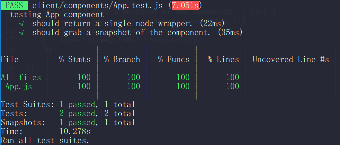

# Jest_testing
> Jest testing setup guide

Configuration for testing is sometimes time consuming. Here, I'm going to talk about how to set up Jest and Enzyme for unit testing for your React app.

And, I'm assuming that 
* you are not using 'create-react-app'.
* you are using 'webpack' to bundle your React app.



If you run this code, then you will see this code coverage.

### Step 1
> Download npm packages

```
npm install -D jest babel-jest react-test-renderer enzyme enzyme-adapter-react-16 identity-obj-proxy
```

### Step 2-1
> Add some additional properties in the "script" property in the 'package.json' file

```
...

"test": "jest",
"test:w": "jest --watchAll",
"test:c": "jest --coverage",

...
```

### Step 2-2
> Add "jest" property

```
...

  "jest": {
    "setupFilesAfterEnv": [
      "<rootDir>client/setupTests.js"
    ],
    "moduleNameMapper": {
      "\\.(css|less)$": "identity-obj-proxy"
    }
  }

...
```

### Step 2-3
> If you forgot to add "babel" property, then add it now.

```
...

  "babel": {
    "presets": [
      "@babel/preset-env",
      "@babel/preset-react"
    ]
  }

...
```

### Step 3
> Add "/coverage" in the .gitignore file

```
/node_modules
/coverage
```

### Step 4
> Create a file 'setupTests.js' right next to 'index.jsx' in the client folder.

```
import { configure } from 'enzyme';
import Adapter from 'enzyme-adapter-react-16';
configure({ adapter: new Adapter() });
```

### Step 5
> Create a file 'App.test.js' right next to 'App.jsx'.

```
import React from 'react';
import renderer from 'react-test-renderer';
import { shallow } from 'enzyme';
import App from './App';

describe('testing App component', ()=> {

	//shallow rendering by Enzyme
	it('should return a single-node wrapper.', ()=> {
		expect(shallow(<App />).length).toEqual(1)
	})

	//snapshot testing by Jest
	it('should grab a snapshot of the component.', ()=> {
		const component = renderer.create(<App />)
		let tree = component.toJSON();
		expect(tree).toMatchSnapshot();
	})

})
```

### Step 6
> Run it in your terminal

```
npm run test:c
```
Then, you will see the code coverage!


## Meta

James Jongho Kim 
- [Portfolio](https://april9288.github.io/) - It's my portfolio website
- [Github](https://github.com/april9288) - This is my Github page
- [Linkedin](https://www.linkedin.com/in/jongho-kim-b05618170/) - This is my Linkedin page
- april9288@gmail.com
